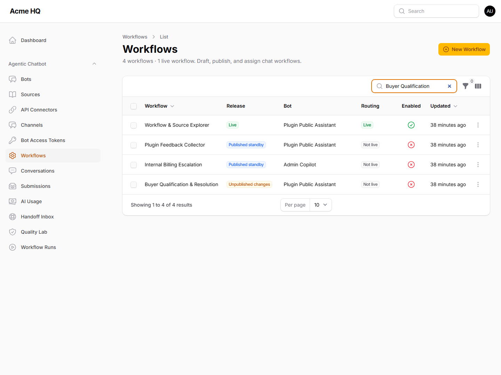

# Agentic Workflows

This page explains the biggest capability gap between the earlier Filament RAG plugin and Filament Agentic Chatbot: workflows.

## What A Workflow Is

A workflow is a visual graph that defines how a bot should behave over multiple steps.

Instead of always taking this path:

1. user asks a question
2. retrieve context
3. answer

A workflow can do something more structured:

1. greet the user
2. collect input
3. retrieve knowledge
4. classify intent
5. branch into different paths
6. call an action or external API
7. send the right next response

## Why Workflows Matter

Workflows turn the plugin from a knowledge chatbot into an assistant platform.

They are useful when the assistant must:

- ask clarifying questions
- gather structured data
- route people by intent
- create a ticket, send a lead, or trigger an integration
- escalate when the knowledge base is weak
- guide a user through an onboarding or troubleshooting flow

## Workflow Product Tour

### Workflow library

See active and draft workflows, linked bots, and release-ready configurations from the Filament panel.

### Visual editor

Use the plugin feedback collector as a concrete example: the node library stays on the left, the canvas sits in the middle, and inline settings remain visible on the right while you build.

### AI-assisted drafting

Describe the flow you want in natural language, generate a first draft, then review and refine it before publishing.

### Run inspection and debugging

Inspect execution history, current node, variables, and traces when validating or debugging a workflow.

### Release history

Keep draft changes separate from the live workflow, add publish notes, and roll back to earlier versions when needed.

### API connector reuse

Save external API profiles once and reference them from multiple workflows instead of repeating auth and timeout settings everywhere.

## Common Workflow Building Blocks

### Trigger

Starts the workflow when a user message, event, or webhook is received.

### Send Message

Sends text or UI content back to the user.

### Collect Input

Asks the user for structured input such as text, email, number, or choice values.

### Condition And Switch Routing

Branches the workflow based on rules or classification results.

### AI Agent Node

Uses the configured model for tasks such as:

- classification
- summarization
- extraction
- response generation
- decision support

### Knowledge Base Node

Runs RAG retrieval inside the workflow so the assistant can stay grounded while still following a multi-step process.

### Action Node

Calls backend actions registered in your app.

Typical examples include:

- create support ticket
- send email
- save lead data
- trigger a custom business action

### HTTP Request Node

Calls external APIs from the workflow when you need to integrate with another system.

### API Connector Node

Calls a saved connector profile so you can reuse base URLs, auth, headers, and timeout settings across workflows.

## Recommended Adoption Path

Do not start by making every bot fully agentic.

A cleaner path is:

1. launch a simple RAG bot first
2. confirm your sources, retrieval settings, and widget UX are solid
3. identify a workflow-heavy use case where pure Q&A is not enough
4. add workflows only for that case

## Strong Early Workflow Use Cases

- sales qualification
- support triage
- onboarding wizards
- FAQ plus escalation
- helpdesk intake
- feedback collection

## Best Practices

- Keep workflows focused on one job
- Use retrieval where accuracy matters
- Use branching where the user journey really changes
- Review AI-generated workflows before publishing
- Keep default/fallback branches for unexpected inputs
- Run a real queue worker if you use delay or resume behavior

## Related Docs

- [API Connectors](API_CONNECTORS.md) — reusable external API profiles
- [How It Differs From Filament RAG](HOW_IT_DIFFERS_FROM_FILAMENT_RAG.md)
- [Workflow Prompt Templates](WORKFLOW_PROMPT_TEMPLATES.md)
- [Workflow JSON Schema](WORKFLOW_JSON_SCHEMA.md)
- [Bots](BOTS.md)
- [Operations](OPERATIONS.md)
