# Agentic Chatbot (Filament Plugin)

Build, manage, and embed production-ready **agentic AI assistants** directly from your Filament panel.

This plugin includes a full **RAG chatbot foundation** and extends it with **visual workflows**, **branching logic**, **AI agent nodes**, **actions**, and **HTTP integrations**.

## What you get

- Filament resources for bots, sources, workflows, and conversations
- Queue-based ingestion for text, file, and URL sources
- `pgvector` (recommended) or ChromaDB vector backends
- Streaming chat with grounded retrieval and citations
- Embeddable widget plus optional NPM loader
- Workflow builder for guided conversations and automations
- Privacy workflows for export and delete of chat history
- Operational readiness via `php artisan filament-agentic-chatbot:doctor`

## Product tour

### Bot list

Manage multiple assistants from a Filament-native control plane.

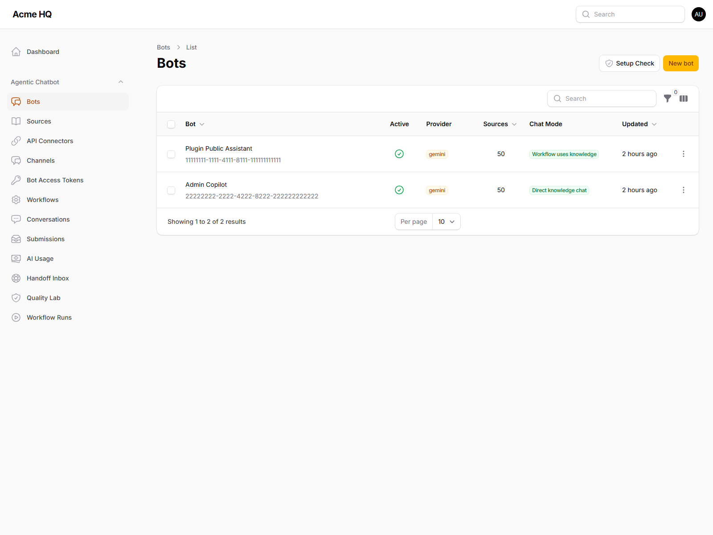

### Bot editing

Configure prompt, model, retrieval, access, and widget presentation per bot.

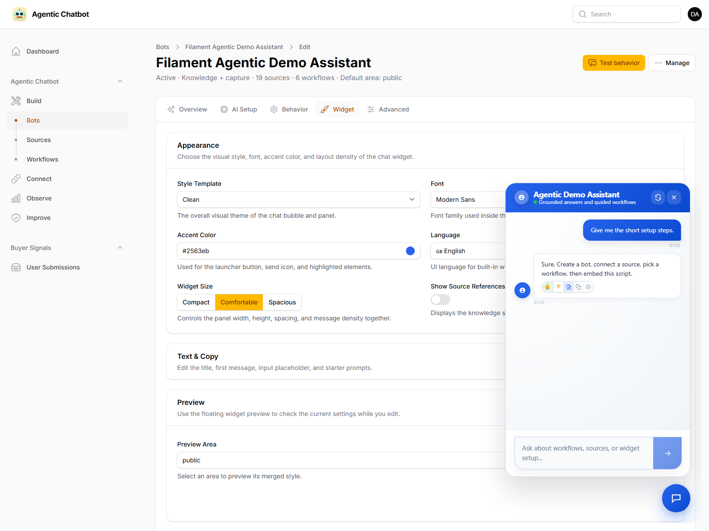

### Source ingestion

Track source status and ingestion progress directly in the panel.

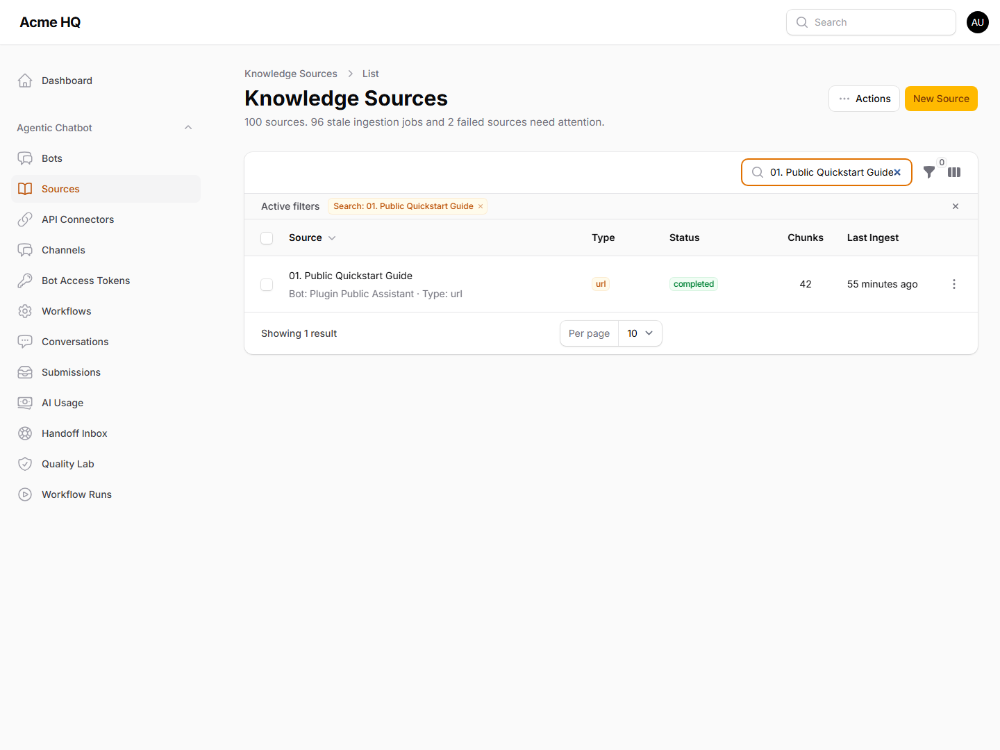

### Conversation review

Inspect conversation history without leaving Filament.

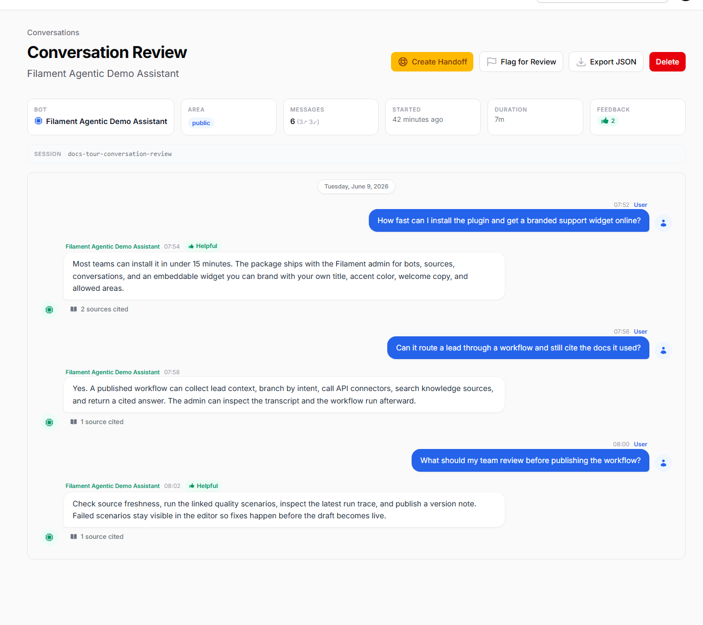

### Workflow builder

Design agentic flows that mix retrieval, intent routing, AI nodes, actions, and connectors.

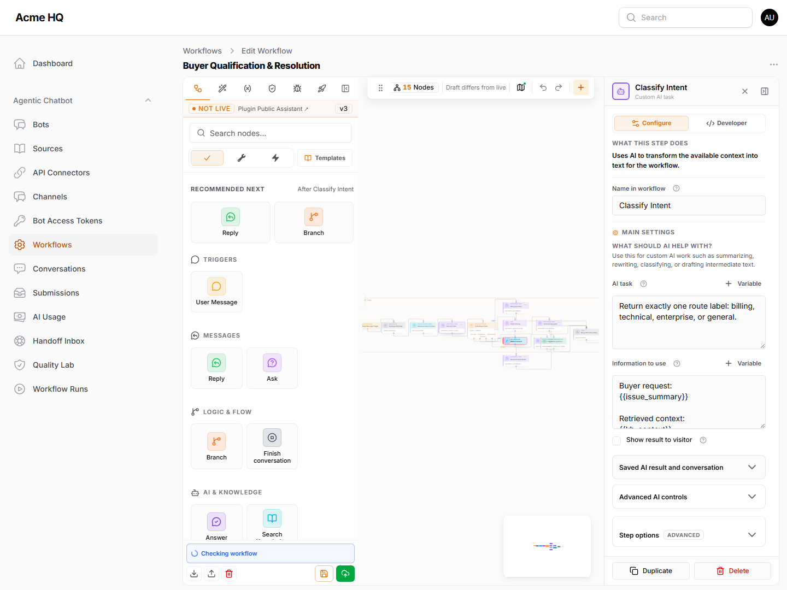

### Workflow operations

Generate drafts from prompts, inspect workflow runs, and publish with release notes.

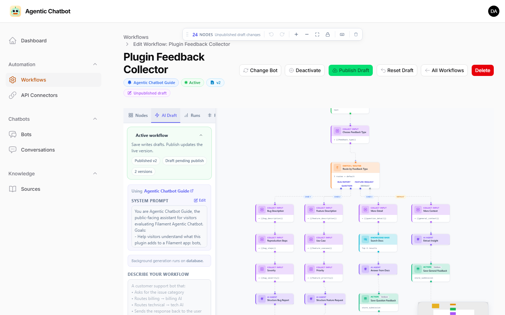

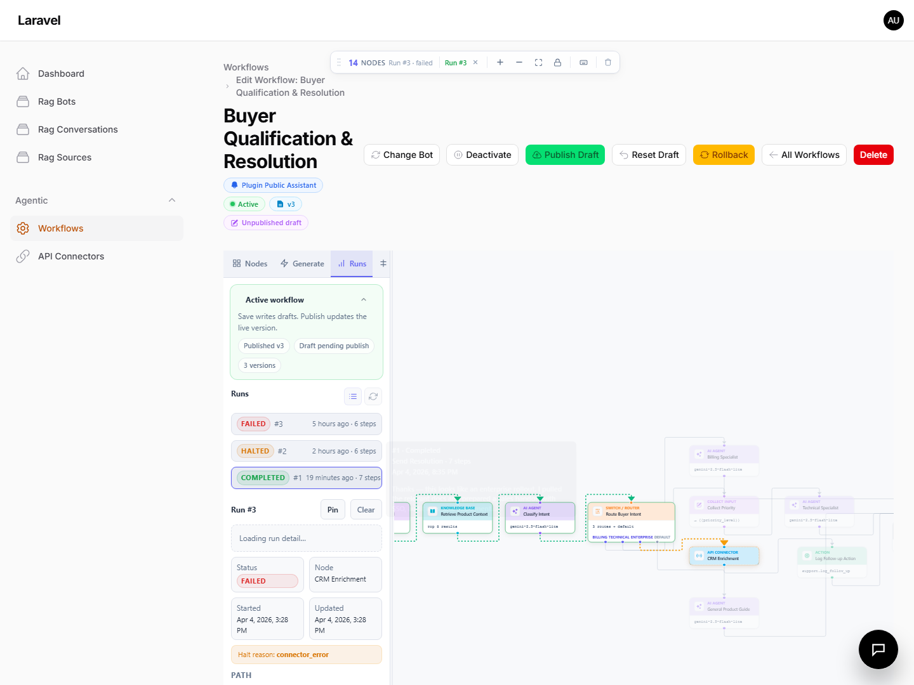

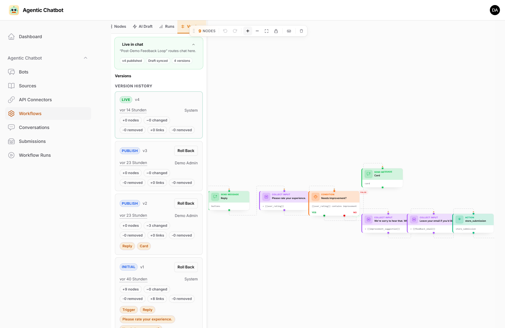

### API connectors

Reuse external API connection profiles across workflows.

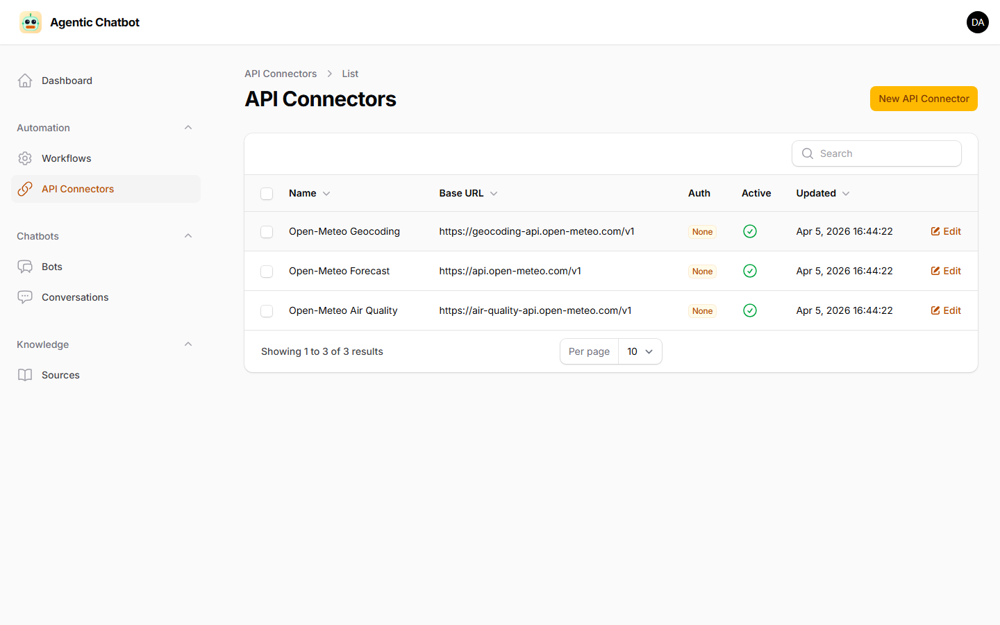

### Widget desktop and mobile

The embeddable widget is polished out of the box across device sizes.

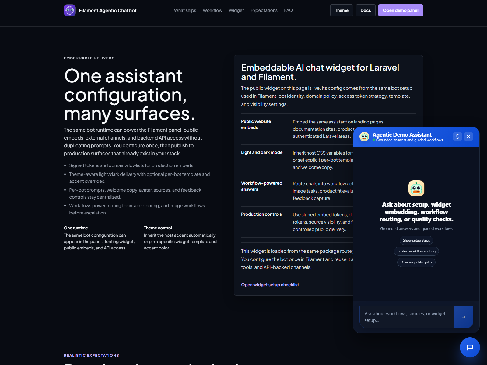

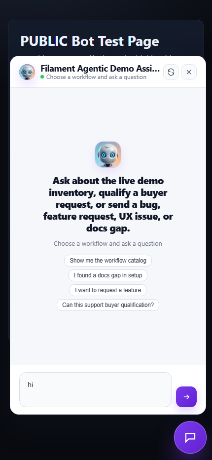

## Why this is different from the earlier RAG plugin

The earlier Filament RAG plugin is focused on grounded Q&A over a knowledge base.

This plugin keeps that and adds a workflow engine so the assistant can:

- ask follow-up questions
- classify intent
- branch into different paths
- collect structured data
- call backend actions or external APIs
- escalate when confidence is low

In short:

- **Filament RAG** = grounded chatbot
- **Filament Agentic Chatbot** = grounded chatbot **plus** guided task flows and automation

## Typical use cases

- Product documentation chatbot
- Lead qualification assistant
- Customer support triage assistant
- Onboarding wizard
- Internal helpdesk assistant
- AI copilots that mix retrieval with workflow logic

## Requirements

- PHP `8.4+`
- Laravel `12+`
- Filament `5.2+`
- PostgreSQL + `pgvector` (recommended) or ChromaDB
- An AI provider key compatible with `laravel/ai`

## Installation

```bash
composer require heiner/filament-agentic-chatbot
php artisan vendor:publish --tag=filament-agentic-chatbot-config
php artisan migrate
php artisan queue:work
```

Register the plugin in your panel provider:

```php
use Heiner\FilamentAgenticChatbot\FilamentAgenticChatbotPlugin;

->plugins([
    FilamentAgenticChatbotPlugin::make(),
])
```

## Quick configuration

```env
RAG_VECTOR_BACKEND=pgvector
RAG_DB_CONNECTION=rag_pgsql
RAG_DB_HOST=127.0.0.1
RAG_DB_PORT=5432
RAG_DB_DATABASE=filament_agentic_chatbot
RAG_DB_USERNAME=postgres
RAG_DB_PASSWORD=secret
RAG_CHAT_PROVIDER=gemini
RAG_CHAT_MODEL=gemini-2.5-flash-lite
RAG_EMBEDDING_PROVIDER=gemini
RAG_EMBEDDING_MODEL=gemini-embedding-001
RAG_VECTOR_DIMENSIONS=1536
RAG_WIDGET_SIGNING_ENABLED=true
RAG_WIDGET_SIGNING_KEY=replace-with-a-long-random-secret
GEMINI_API_KEY=your-key-here
```

## Fastest path to value

1. Create a bot
2. Add one or more RAG sources
3. Wait for ingestion to complete
4. Test retrieval and answers
5. Embed the widget
6. Add workflows only when you need guided multi-step behavior

## � Workflow examples

Get started fast with **7 ready-to-import workflows** covering real-world scenarios:

| Workflow | What it shows |
|----------|---------------|
| SaaS Onboarding | Progressive intake + enterprise lead routing |
| Support Ticket Router | AI intent classification → 4-department switch |
| E-Commerce Order Status | External API lookup + status-based card messages |
| Lead Qualification | Multi-step collection + CRM action |
| Webhook Inventory Alert | Headless webhook → email + Slack alerts |
| FAQ with Confidence Check | Two-stage AI confidence evaluation |
| Content Research Assistant | KB research → outline → full draft |

👉 **[Browse & download workflow examples](https://github.com/heinergiehl/agentic-chatbot-workflow-examples)**

Import any JSON file through the workflow editor's **📥 Import** button — it takes seconds.

## �🚀 Live demo

Try the plugin before you buy: **[filament-agentic-chatbot.heinerdevelops.tech](https://filament-agentic-chatbot.heinerdevelops.tech/)**

Log in with the demo credentials on the login page. The demo includes pre-configured bots, ingested documentation sources, sample workflows, and a live chat widget.

## Best next docs

- Product overview: [PRODUCT_OVERVIEW.md](https://github.com/heinergiehl/agentic-chatbot-filament-docs/blob/main/PRODUCT_OVERVIEW.md)
- How it differs from Filament RAG: [HOW_IT_DIFFERS_FROM_FILAMENT_RAG.md](https://github.com/heinergiehl/agentic-chatbot-filament-docs/blob/main/HOW_IT_DIFFERS_FROM_FILAMENT_RAG.md)
- Quickstart: [QUICKSTART.md](https://github.com/heinergiehl/agentic-chatbot-filament-docs/blob/main/QUICKSTART.md)
- Agentic workflows: [AGENTIC_WORKFLOWS.md](https://github.com/heinergiehl/agentic-chatbot-filament-docs/blob/main/AGENTIC_WORKFLOWS.md)
- API connectors: [API_CONNECTORS.md](https://github.com/heinergiehl/agentic-chatbot-filament-docs/blob/main/API_CONNECTORS.md)
- Chat widget: [CHAT_WIDGET.md](https://github.com/heinergiehl/agentic-chatbot-filament-docs/blob/main/CHAT_WIDGET.md)
- Support policy: [SUPPORT_POLICY.md](https://github.com/heinergiehl/agentic-chatbot-filament-docs/blob/main/SUPPORT_POLICY.md)
- Refund and license: [REFUND_AND_LICENSE.md](https://github.com/heinergiehl/agentic-chatbot-filament-docs/blob/main/REFUND_AND_LICENSE.md)
