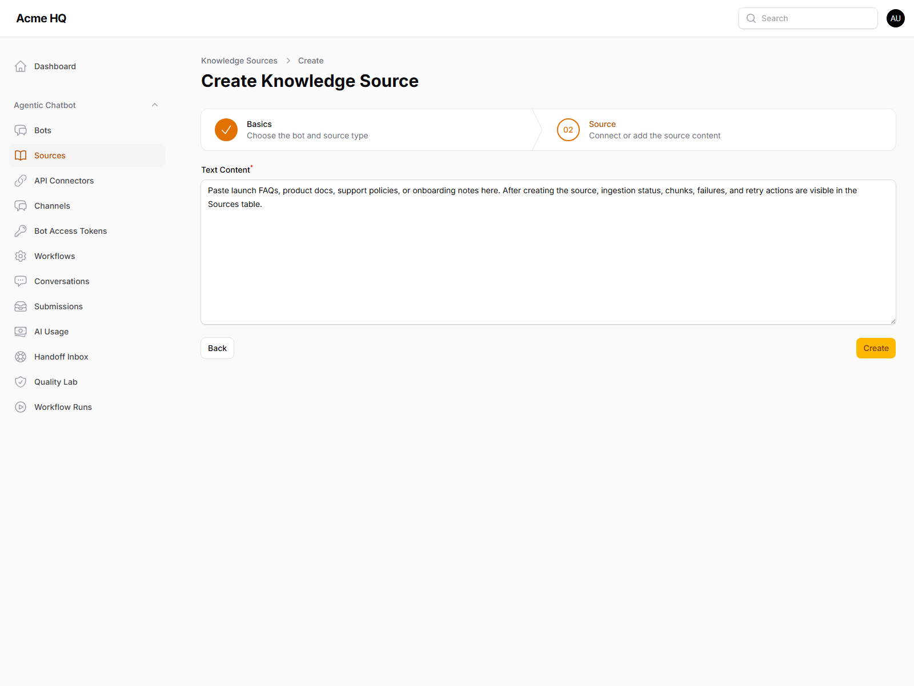
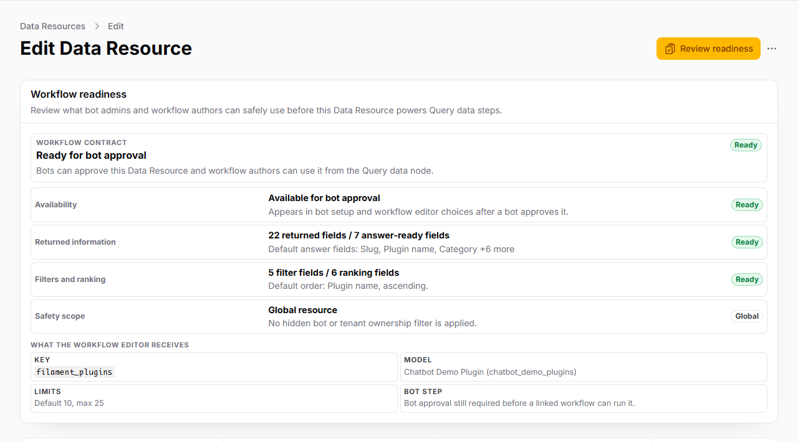
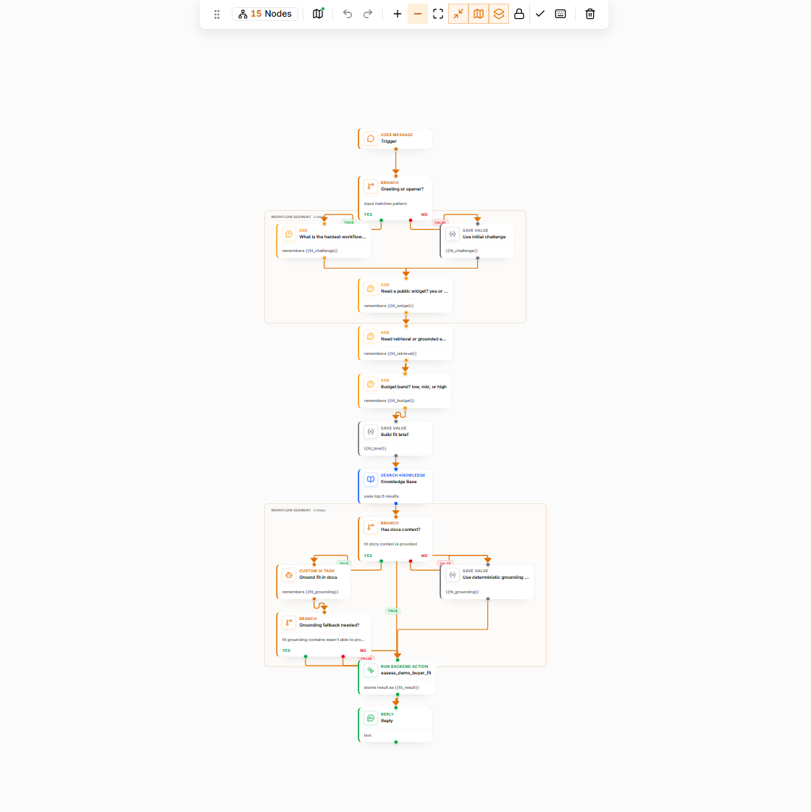
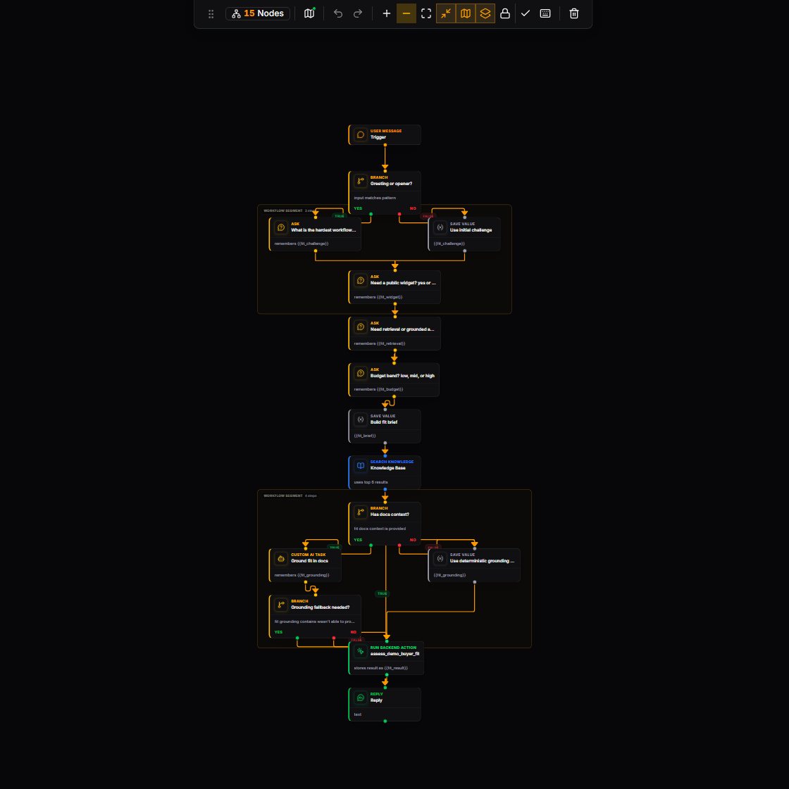
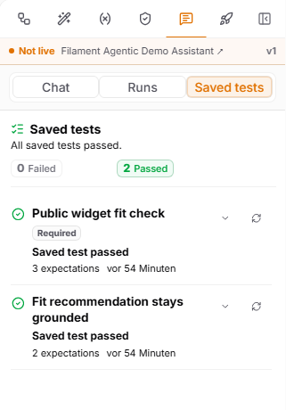
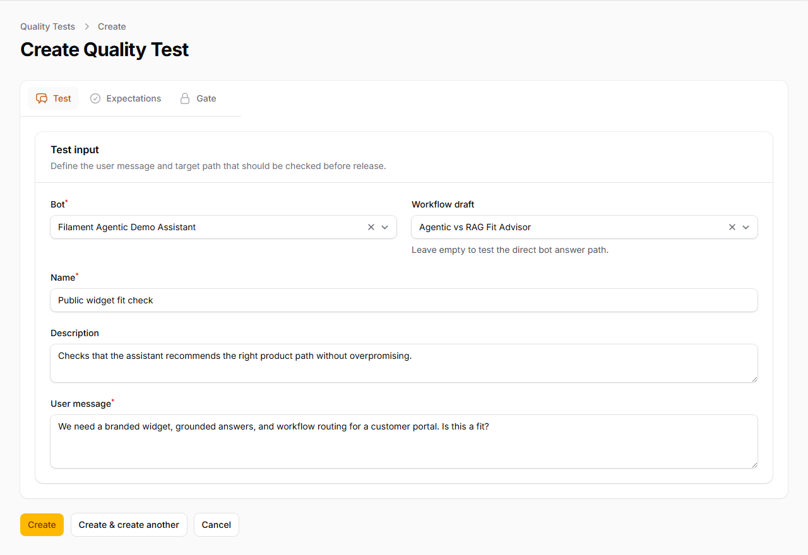
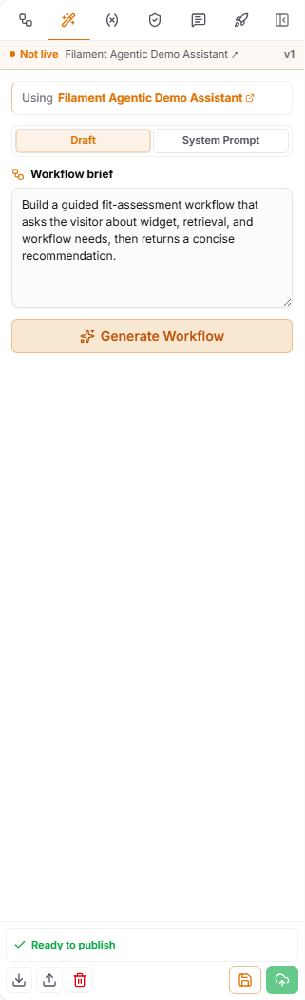
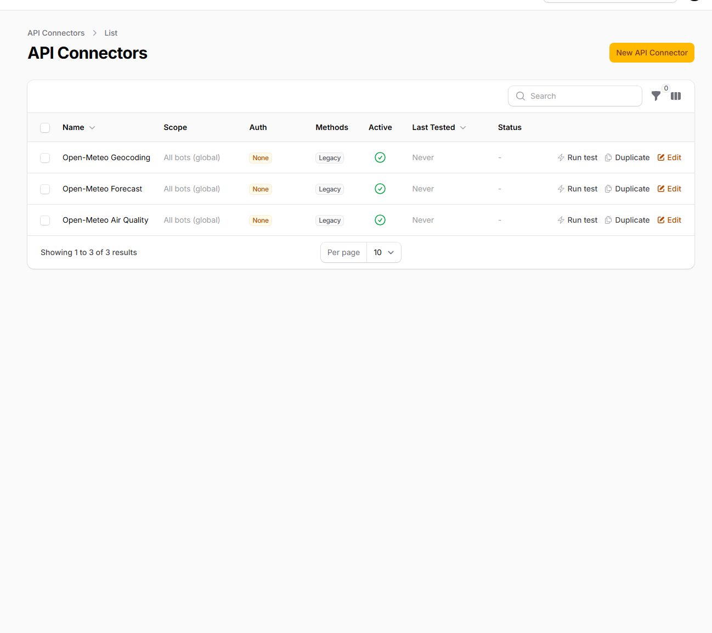

# Filament Agentic Chatbot — Documentation

Public documentation for the [heiner/filament-agentic-chatbot](https://github.com/heinergiehl/filament-agentic-chatbot) plugin.

This repository is organized so buyers, evaluators, implementers, and support users can jump directly to the page they need instead of digging through one long README.

> For Filament marketplace `docs_url`, use [FILAMENT_PLUGIN_PAGE.md](FILAMENT_PLUGIN_PAGE.md), not this README. Filament renders a single raw Markdown file and does not resolve repository-relative links like GitHub does.

---

## 🚀 Live Demo

Try the plugin before you buy:

**[filament-agentic-chatbot.heinerdevelops.tech](https://filament-agentic-chatbot.heinerdevelops.tech/)**

Log in with the demo credentials on the login page. The demo includes pre-configured bots, ingested documentation sources, sample workflows, and a live chat widget.

---

## 📦 Workflow Examples

15 ready-to-import workflow JSON files demonstrate real-world scenarios including onboarding, support routing, order tracking, lead qualification, feedback capture, image delivery, scoped memory, and adversarial reliability testing:

**[Browse the examples](examples/README.md)**

---

## Versioned Documentation

`main` tracks the latest documentation work. Frozen documentation snapshots are tagged to match plugin releases:

- Current docs snapshot: [v0.15.0 release](https://github.com/heinergiehl/agentic-chatbot-filament-docs/releases/tag/v0.15.0)
- Current docs tag: [`v0.15.0`](https://github.com/heinergiehl/agentic-chatbot-filament-docs/tree/v0.15.0)
- Historical snapshots: [`v0.12.0`](https://github.com/heinergiehl/agentic-chatbot-filament-docs/tree/v0.12.0), [`v0.9.8`](https://github.com/heinergiehl/agentic-chatbot-filament-docs/tree/v0.9.8)

When the plugin ships a new version, the docs repo should receive the same tag, for example plugin `v0.14.0` -> docs `v0.14.0`.

---

## Start Here

If you are evaluating the plugin, read these in order:

1. [Product Overview](PRODUCT_OVERVIEW.md)
2. [How It Differs From Filament RAG](HOW_IT_DIFFERS_FROM_FILAMENT_RAG.md)
3. [Core Concepts](CORE_CONCEPTS.md)
4. [Quickstart](QUICKSTART.md)

## What This Plugin Is

Filament Agentic Chatbot is the newer, broader plugin in the product line.

It keeps the source-grounded answer capabilities of the earlier Filament RAG plugin and adds:

- visual workflows
- assistant graph orchestration with optional knowledge search and workflows exposed as tools
- branching logic
- AI agent nodes
- action and HTTP nodes
- API connectors for external services
- Smart Data Queries for safe natural-language lookups against allowed internal resources
- guided Data Resources for UI-managed live Eloquent reads with field policies, result caps, safety scopes, and per-bot narrowing
- API-fed knowledge sources for JSON records
- assistant profile controls for tone, boundaries, and fallback behavior
- quality scenarios, workflow-linked quality runs, and feedback-to-scenario review loops
- human handoff queues for low-confidence or operator-required conversations
- package-owned Telegram and Slack channel integrations
- guided intake, routing, and escalation flows

That means it can work as:

- a straightforward documentation chatbot
- a product onboarding assistant
- a lead qualification assistant
- a support triage assistant
- an internal ops assistant with workflow logic

## Product Tour

These are real screenshots from the current product surface. The main plugin page intentionally uses a smaller set of higher-signal screenshots; this README keeps a few extra supporting views for implementers.

### Control plane

Manage bots from a Filament-native admin area with clear navigation for build, connect, observe, improve, and buyer-signal workflows.

### Widget live preview

Tune widget template, font, accent color, size, copy, starter prompts, and source visibility while the floating preview updates beside the form.

### Knowledge source setup

Create URL, file, text, or API-backed sources from a guided form. Detailed ingestion tables live in the product, but the docs avoid leading with status-heavy table screenshots.

### Data Resource readiness

`v0.15.0` adds a Filament-managed Data Resources workflow for safe live database answers. Admins approve the model, allowed fields, answer-ready defaults, filtering, sorting, limits, and safety scope before a bot or workflow can query live records.

### Conversation review

Review transcripts, citations, feedback, session metadata, handoff actions, flags, and export controls in one Filament screen.

### Public widget

The public widget can reuse the same bot configuration across landing pages, documentation sites, product surfaces, and authenticated Laravel areas.

### Workflow library

Start from the workflow list to see active workflows, assigned bots, and available drafts before opening the editor.

### Visual workflow editor

The workflow editor keeps the node catalog, graph, selected-node inspector, toolbar, minimap, and publish readiness visible together. The screenshot uses a compact 15-node fit-advisor workflow so the graph is readable.

### Focus and dark mode

Focus mode removes surrounding chrome and side panels when the canvas needs attention. Dark mode keeps the same graph readable for longer authoring and debugging sessions.

### Workflow quality loop

Saved tests sit beside the draft, show current pass state, and can participate in release gates.

Create repeatable quality tests for direct bot answers or workflow drafts.

### AI drafting and connectors

Use the Generate tab for a first workflow draft from a plain-language brief, then wire reusable API connector profiles into workflow nodes or API-backed sources.

## Documentation Map

### Evaluate The Plugin

- [Product Overview](PRODUCT_OVERVIEW.md)
- [How It Differs From Filament RAG](HOW_IT_DIFFERS_FROM_FILAMENT_RAG.md)
- [Core Concepts](CORE_CONCEPTS.md)
- [Reference Links](REFERENCE_LINKS.md)

### Install And Launch

- [Quickstart](QUICKSTART.md)
- [Operations](OPERATIONS.md)
- [Upgrading](UPGRADING.md)
- [Database And Breaking Changes](DATABASE_AND_BREAKING_CHANGES.md)
- [Security And Privacy](SECURITY_AND_PRIVACY.md)

### Learn The Product Model

- [Bots](BOTS.md)
- [Agent Runtime Architecture](AGENT_RUNTIME_ARCHITECTURE.md)
- [Knowledge Sources](KNOWLEDGE_SOURCES.md)
- [Ingestion And Retrieval](INGESTION_AND_RETRIEVAL.md)
- [Agentic Workflows](AGENTIC_WORKFLOWS.md)
- [Quality Loop](QUALITY_LOOP.md)
- [Smart Workflow Builder](SMART_WORKFLOW_BUILDER.md)
- [AgentGraph SDK Usage](AGENTGRAPH_SDK_USAGE.md)
- [Database And Breaking Changes](DATABASE_AND_BREAKING_CHANGES.md)
- [API Connectors](API_CONNECTORS.md)
- [API Integrations](API_INTEGRATIONS.md)
- [Channel Integrations](CHANNELS.md)
- [API Source Roadmap](API_SOURCE_ROADMAP.md)
- [OpenAI-Compatible Providers](OPENAI_COMPATIBLE_PROVIDERS.md)
- [Incident Management Blueprint](INCIDENT_MANAGEMENT_BLUEPRINT.md)
- [Incident Management Example](examples/incident-management/README.md)
- [Localization](LOCALIZATION.md)
- [Release Notes v0.15.0](RELEASE_NOTES_v0.15.0.md)
- [Release Notes v0.13.0](RELEASE_NOTES_v0.13.0.md)
- [Docs Snapshot v0.15.0](https://github.com/heinergiehl/agentic-chatbot-filament-docs/releases/tag/v0.15.0)
- [Changelog](CHANGELOG.md)
- [AgentGraph SDK Refactor Notes](RELEASE_NOTES_AGENTGRAPH_SDK_REFACTOR.md)
- [Workflow Prompt Templates](WORKFLOW_PROMPT_TEMPLATES.md)
- [Workflow JSON Schema](WORKFLOW_JSON_SCHEMA.md)
- [Chat Widget](CHAT_WIDGET.md)
- [Context Areas](CONTEXT_AREAS.md)
- [Conversations And Messages](CONVERSATIONS_AND_MESSAGES.md)

### Policies And Support

- [Support Policy](SUPPORT_POLICY.md)
- [Refund And License](REFUND_AND_LICENSE.md)
- [Security And Privacy](SECURITY_AND_PRIVACY.md)
- [Data Retention Policy](DATA_RETENTION_POLICY.md)
- [Privacy Policy Template](PRIVACY_POLICY_TEMPLATE.md)
- [Known Limitations](KNOWN_LIMITATIONS.md)

## Common Questions

- What does the plugin add? → [Product Overview](PRODUCT_OVERVIEW.md)
- How is it different from the older RAG plugin? → [How It Differs From Filament RAG](HOW_IT_DIFFERS_FROM_FILAMENT_RAG.md)
- Can I use it as a simple source-grounded chatbot first? → [Quickstart](QUICKSTART.md)
- How do workflows fit in? → [Agentic Workflows](AGENTIC_WORKFLOWS.md)
- How do I improve assistant quality after feedback? → [Quality Loop](QUALITY_LOOP.md)
- What changed in the database after the AgentGraph SDK refactor? → [Database And Breaking Changes](DATABASE_AND_BREAKING_CHANGES.md)
- How do I set up API connectors for external services? → [API Connectors](API_CONNECTORS.md)
- How do I connect Telegram or Slack? → [Channel Integrations](CHANNELS.md)
- How do I call a bot from a custom backend? → [API Integrations](API_INTEGRATIONS.md)
- How do I use Qwen, DeepSeek, or another OpenAI-compatible gateway? → [OpenAI-Compatible Providers](OPENAI_COMPATIBLE_PROVIDERS.md)
- How would this work for incident management data? → [Incident Management Blueprint](INCIDENT_MANAGEMENT_BLUEPRINT.md) and [Incident Management Example](examples/incident-management/README.md)
- Can the bot use API-fed knowledge or database-backed resources? → [Knowledge Sources](KNOWLEDGE_SOURCES.md), [API Source Roadmap](API_SOURCE_ROADMAP.md), and [Agentic Workflows](AGENTIC_WORKFLOWS.md)
- How do workflow focus mode, releases, traces, quality checks, and connectors look in practice? → [Agentic Workflows](AGENTIC_WORKFLOWS.md) and [Quality Loop](QUALITY_LOOP.md)
- How do I generate workflow JSON? → [Workflow JSON Schema](WORKFLOW_JSON_SCHEMA.md)
- How do I embed the widget? → [Chat Widget](CHAT_WIDGET.md)
- How do I translate the package UI? → [Localization](LOCALIZATION.md)

## Versioning

Docs should track plugin releases. If the plugin release is `vX.Y.Z`, the matching docs snapshot should be tagged the same way.

The current public docs snapshot is `v0.15.0`. The current runtime compatibility baseline is PHP 8.3+, Laravel 12 or 13, Filament 5.2+, `laravel/ai` `^0.7 || ^1.0`, and `heiner/agent-graph` `^0.13.0` as the transitive workflow runtime. The `v0.12.0` tag was an early preview; new installs should target `^0.15.0`.

## Related Repositories

- Plugin code: [heinergiehl/filament-agentic-chatbot](https://github.com/heinergiehl/filament-agentic-chatbot)
- Public docs: [heinergiehl/agentic-chatbot-filament-docs](https://github.com/heinergiehl/agentic-chatbot-filament-docs)
- Older RAG-only docs: [heinergiehl/rag-filament-docs](https://github.com/heinergiehl/rag-filament-docs)
