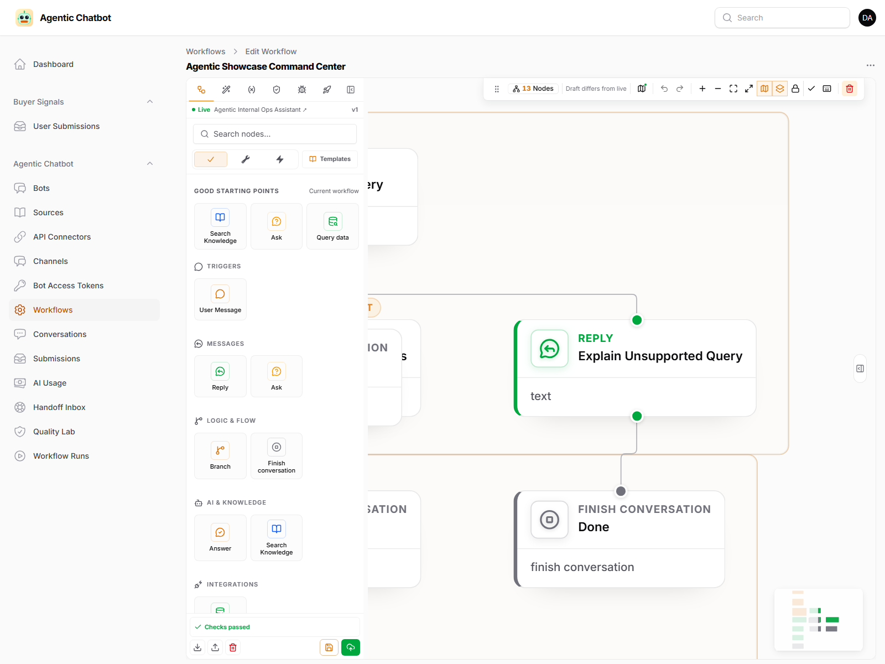
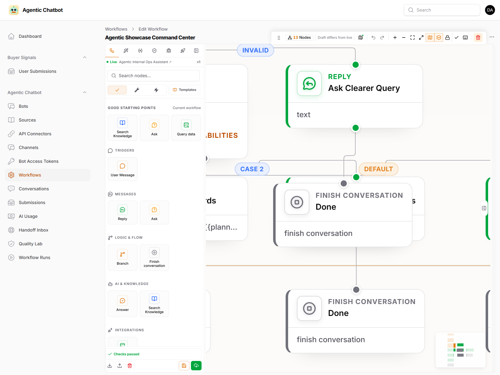
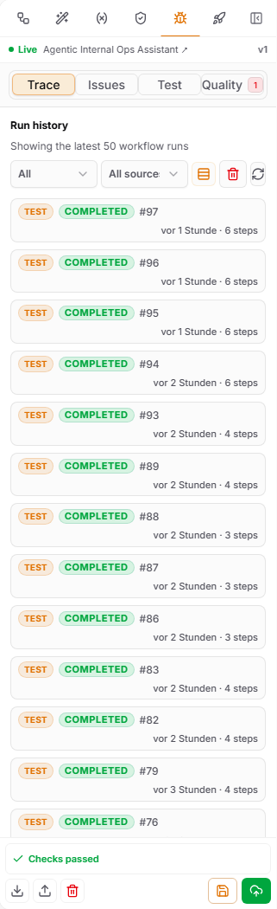
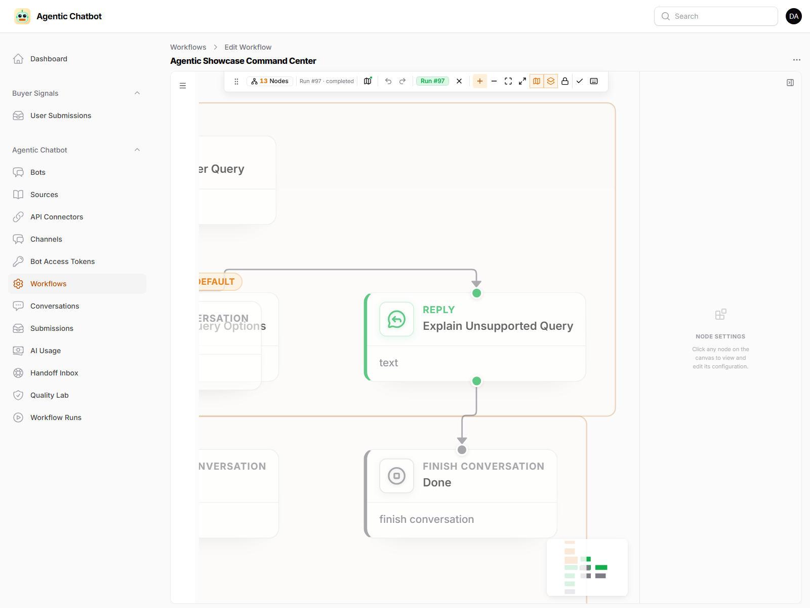
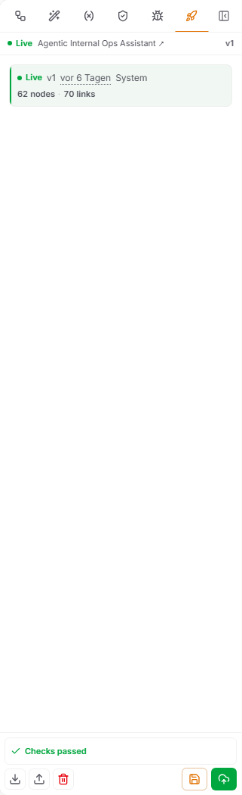
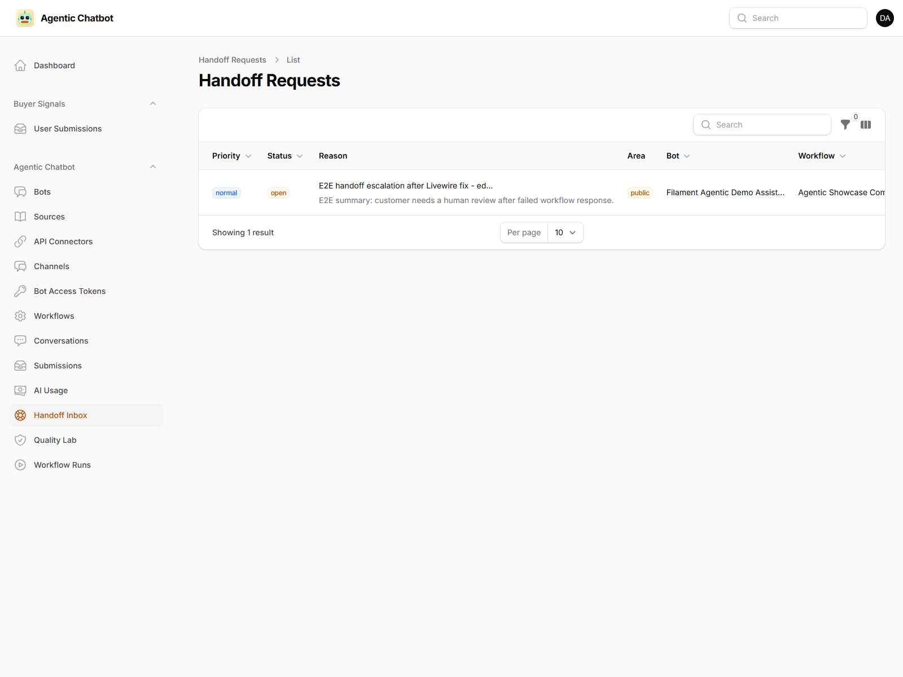

# Filament Agentic Chatbot — Documentation

Public documentation for the [heiner/filament-agentic-chatbot](https://github.com/heinergiehl/filament-agentic-chatbot) plugin.

This repository is organized so buyers, evaluators, implementers, and support users can jump directly to the page they need instead of digging through one long README.

> For Filament marketplace `docs_url`, use [FILAMENT_PLUGIN_PAGE.md](FILAMENT_PLUGIN_PAGE.md), not this README. Filament renders a single raw Markdown file and does not resolve repository-relative links like GitHub does.

---

## 🚀 Live Demo

Try the plugin before you buy:

**[filament-agentic-chatbot.heinerdevelops.tech](https://filament-agentic-chatbot.heinerdevelops.tech/)**

Log in with the demo credentials on the login page. The demo includes pre-configured bots, ingested documentation sources, sample workflows, and a live chat widget.

---

## 📦 Workflow Examples

15 ready-to-import workflow JSON files demonstrate real-world scenarios including onboarding, support routing, order tracking, lead qualification, feedback capture, image delivery, scoped memory, and adversarial reliability testing:

**[Browse the examples](examples/README.md)**

---

## Versioned Documentation

`main` tracks the latest documentation work. Frozen documentation snapshots are tagged to match plugin releases:

- Current plugin release docs: [v0.13.0 release](https://github.com/heinergiehl/agentic-chatbot-filament-docs/releases/tag/v0.13.0)
- Current plugin release tag: [`v0.13.0`](https://github.com/heinergiehl/agentic-chatbot-filament-docs/tree/v0.13.0)
- Historical snapshots: [`v0.12.0`](https://github.com/heinergiehl/agentic-chatbot-filament-docs/tree/v0.12.0), [`v0.9.8`](https://github.com/heinergiehl/agentic-chatbot-filament-docs/tree/v0.9.8)

When the plugin ships a new version, the docs repo should receive the same tag, for example plugin `v0.14.0` -> docs `v0.14.0`.

---

## Start Here

If you are evaluating the plugin, read these in order:

1. [Product Overview](PRODUCT_OVERVIEW.md)
2. [How It Differs From Filament RAG](HOW_IT_DIFFERS_FROM_FILAMENT_RAG.md)
3. [Core Concepts](CORE_CONCEPTS.md)
4. [Quickstart](QUICKSTART.md)

## What This Plugin Is

Filament Agentic Chatbot is the newer, broader plugin in the product line.

It keeps the source-grounded answer capabilities of the earlier Filament RAG plugin and adds:

- visual workflows
- assistant graph orchestration with optional knowledge search and workflows exposed as tools
- branching logic
- AI agent nodes
- action and HTTP nodes
- API connectors for external services
- Smart Data Queries for safe natural-language lookups against allowed internal resources
- API-fed knowledge sources for JSON records
- assistant profile controls for tone, boundaries, and fallback behavior
- quality scenarios, workflow-linked quality runs, and feedback-to-scenario review loops
- human handoff queues for low-confidence or operator-required conversations
- package-owned Telegram and Slack channel integrations
- guided intake, routing, and escalation flows

That means it can work as:

- a straightforward documentation chatbot
- a product onboarding assistant
- a lead qualification assistant
- a support triage assistant
- an internal ops assistant with workflow logic

## Product Tour

These are real screenshots from the current product surface.

### Bot management

Manage multiple bots from inside Filament.

### Assistant profile and bot setup

Tune the assistant's persona, tone, answer style, fallback behavior, model, retrieval settings, and widget entry points without leaving the bot editor.

### Source ingestion visibility

Track ingestion status, chunk counts, source type, last ingest time, and source health directly in the panel. Operators can spot stale or failed jobs, re-run ingestion, and confirm that a bot has current knowledge before it is exposed in chat or workflow runs.

### New knowledge source

Create sources from a guided two-step form in the same Filament panel. The first step keeps bot assignment, source name, and source type visible before operators add URL, file, raw text, or API-backed JSON content, so ingestion setup is easy to validate before the source is created.

### Conversation review

Review full multi-turn conversations from inside Filament. User questions, assistant replies, citations, feedback state, session metadata, and operator actions stay together, so support teams can audit quality, flag a response, create a handoff, or export the transcript without reconstructing the chat elsewhere.

### Widget experience

Show the embeddable chat experience up close, including the branded header, structured replies, and quick-prompt chips.

### Workflow library

Start from the workflow library to see which workflows are active, which bot they belong to, and which drafts still differ from the live release.

### Visual workflow editor

Open a real showcase workflow with the node library on the left, the zoomable canvas in the center, and inline settings on the right. The editor is built for day-to-day workflow authoring: pick a node, tune the business fields, validate the draft, and keep the running graph visible while you work.

### Workflow focus mode

Expand the workflow editor to the full viewport when the canvas needs attention. Focus mode keeps the build surface, inspector, draggable toolbar, and primary editor actions visible while removing the surrounding Filament chrome.

### Editor toolbar and themes

The canvas toolbar is a real editor control, not a static header. It can be dragged, repositioned, and used for zoom, fit-to-view, minimap, grouping, locking, validation, and keyboard-shortcut access. When the inspector is collapsed, the toolbar keeps a small right-side gutter so it does not crowd the page action menu.

The same toolbar can be docked above the canvas when the graph needs more vertical space.

The workflow editor follows Filament theme mode. Light mode stays clean for normal admin work, while dark mode gives the canvas and inspector a focused production-editor feel for long authoring sessions.

### Workflow quality panel

Use the editor sidebar for workflow-specific quality checks before publishing. The Quality tab shows linked scenarios, pass/fail state, scores, blocking gates, latency, and fix suggestions without losing the graph context.

### AI drafting

Use the Generate tab when the fastest starting point is a plain-language brief. Operators can choose draft or system-prompt mode, describe the business flow, generate a workflow, and then refine the result on the canvas.

### Run history and traces

Use the Trace tab to inspect recent workflow runs without leaving the editor. Completed runs stay visible in the sidebar, and selecting a run opens the executed path on the canvas for deeper debugging.

### Versions and releases

Publish versioned releases with notes, keep the live version visible, and roll back to prior versions when a draft should not stay live.

### Quality Lab

Create repeatable quality scenarios for direct bot answers or workflow drafts, then use run history to track regressions before they reach users.

### Handoff Inbox

Review low-confidence, blocked, or human-required conversations with priority, assignment, transcript context, and workflow links in one queue.

### API connectors

Manage reusable external API profiles for workflow nodes and API-fed knowledge sources.

## Documentation Map

### Evaluate The Plugin

- [Product Overview](PRODUCT_OVERVIEW.md)
- [How It Differs From Filament RAG](HOW_IT_DIFFERS_FROM_FILAMENT_RAG.md)
- [Core Concepts](CORE_CONCEPTS.md)
- [Reference Links](REFERENCE_LINKS.md)

### Install And Launch

- [Quickstart](QUICKSTART.md)
- [Operations](OPERATIONS.md)
- [Upgrading](UPGRADING.md)
- [Database And Breaking Changes](DATABASE_AND_BREAKING_CHANGES.md)
- [Security And Privacy](SECURITY_AND_PRIVACY.md)

### Learn The Product Model

- [Bots](BOTS.md)
- [Agent Runtime Architecture](AGENT_RUNTIME_ARCHITECTURE.md)
- [Knowledge Sources](KNOWLEDGE_SOURCES.md)
- [Ingestion And Retrieval](INGESTION_AND_RETRIEVAL.md)
- [Agentic Workflows](AGENTIC_WORKFLOWS.md)
- [Quality Loop](QUALITY_LOOP.md)
- [Smart Workflow Builder](SMART_WORKFLOW_BUILDER.md)
- [AgentGraph SDK Usage](AGENTGRAPH_SDK_USAGE.md)
- [Database And Breaking Changes](DATABASE_AND_BREAKING_CHANGES.md)
- [API Connectors](API_CONNECTORS.md)
- [API Integrations](API_INTEGRATIONS.md)
- [Channel Integrations](CHANNELS.md)
- [API Source Roadmap](API_SOURCE_ROADMAP.md)
- [OpenAI-Compatible Providers](OPENAI_COMPATIBLE_PROVIDERS.md)
- [Incident Management Blueprint](INCIDENT_MANAGEMENT_BLUEPRINT.md)
- [Incident Management Example](examples/incident-management/README.md)
- [Localization](LOCALIZATION.md)
- [Release Notes v0.13.0](RELEASE_NOTES_v0.13.0.md)
- [Changelog](CHANGELOG.md)
- [AgentGraph SDK Refactor Notes](RELEASE_NOTES_AGENTGRAPH_SDK_REFACTOR.md)
- [Workflow Prompt Templates](WORKFLOW_PROMPT_TEMPLATES.md)
- [Workflow JSON Schema](WORKFLOW_JSON_SCHEMA.md)
- [Chat Widget](CHAT_WIDGET.md)
- [Context Areas](CONTEXT_AREAS.md)
- [Conversations And Messages](CONVERSATIONS_AND_MESSAGES.md)

### Policies And Support

- [Support Policy](SUPPORT_POLICY.md)
- [Refund And License](REFUND_AND_LICENSE.md)
- [Security And Privacy](SECURITY_AND_PRIVACY.md)
- [Data Retention Policy](DATA_RETENTION_POLICY.md)
- [Privacy Policy Template](PRIVACY_POLICY_TEMPLATE.md)
- [Known Limitations](KNOWN_LIMITATIONS.md)

## Common Questions

- What does the plugin add? → [Product Overview](PRODUCT_OVERVIEW.md)
- How is it different from the older RAG plugin? → [How It Differs From Filament RAG](HOW_IT_DIFFERS_FROM_FILAMENT_RAG.md)
- Can I use it as a simple source-grounded chatbot first? → [Quickstart](QUICKSTART.md)
- How do workflows fit in? → [Agentic Workflows](AGENTIC_WORKFLOWS.md)
- How do I improve assistant quality after feedback? → [Quality Loop](QUALITY_LOOP.md)
- What changed in the database after the AgentGraph SDK refactor? → [Database And Breaking Changes](DATABASE_AND_BREAKING_CHANGES.md)
- How do I set up API connectors for external services? → [API Connectors](API_CONNECTORS.md)
- How do I connect Telegram or Slack? → [Channel Integrations](CHANNELS.md)
- How do I call a bot from a custom backend? → [API Integrations](API_INTEGRATIONS.md)
- How do I use Qwen, DeepSeek, or another OpenAI-compatible gateway? → [OpenAI-Compatible Providers](OPENAI_COMPATIBLE_PROVIDERS.md)
- How would this work for incident management data? → [Incident Management Blueprint](INCIDENT_MANAGEMENT_BLUEPRINT.md) and [Incident Management Example](examples/incident-management/README.md)
- Can the bot use API-fed knowledge or database-backed resources? → [Knowledge Sources](KNOWLEDGE_SOURCES.md), [API Source Roadmap](API_SOURCE_ROADMAP.md), and [Agentic Workflows](AGENTIC_WORKFLOWS.md)
- How do workflow focus mode, releases, traces, quality checks, and connectors look in practice? → [Agentic Workflows](AGENTIC_WORKFLOWS.md) and [Quality Loop](QUALITY_LOOP.md)
- How do I generate workflow JSON? → [Workflow JSON Schema](WORKFLOW_JSON_SCHEMA.md)
- How do I embed the widget? → [Chat Widget](CHAT_WIDGET.md)
- How do I translate the package UI? → [Localization](LOCALIZATION.md)

## Versioning

Docs should track plugin releases. If the plugin release is `vX.Y.Z`, the matching docs snapshot should be tagged the same way.

The current public compatibility baseline is `v0.13.0`: PHP 8.3+, Laravel 12 or 13, Filament 5.2+, `laravel/ai` `^0.7 || ^1.0`, and `heiner/agent-graph` `^0.13.0`. The `v0.12.0` tag was an early preview; new installs should target `^0.13.0`.

## Related Repositories

- Plugin code: [heinergiehl/filament-agentic-chatbot](https://github.com/heinergiehl/filament-agentic-chatbot)
- Public docs: [heinergiehl/agentic-chatbot-filament-docs](https://github.com/heinergiehl/agentic-chatbot-filament-docs)
- Older RAG-only docs: [heinergiehl/rag-filament-docs](https://github.com/heinergiehl/rag-filament-docs)
